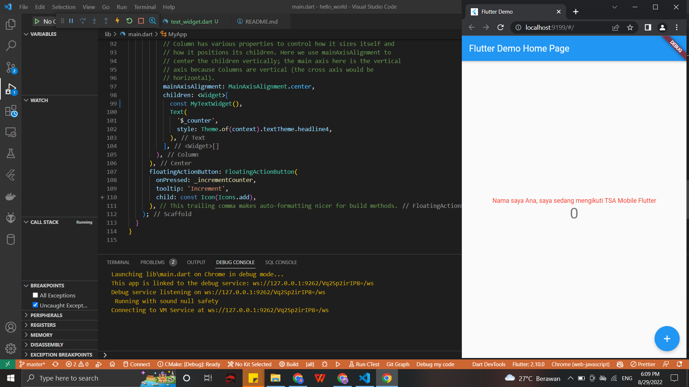
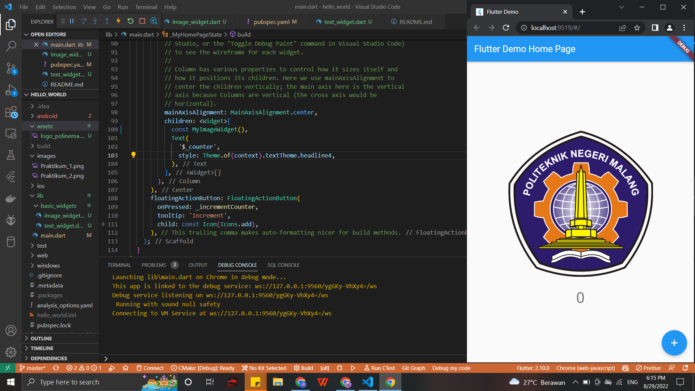
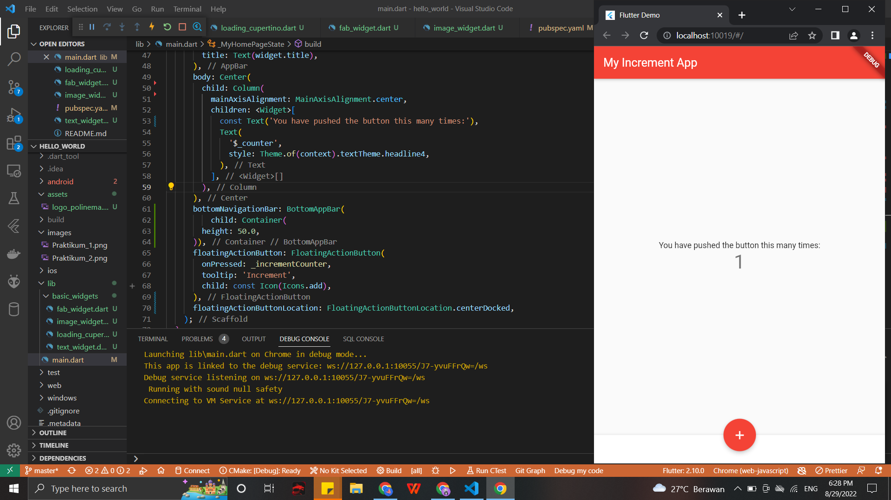
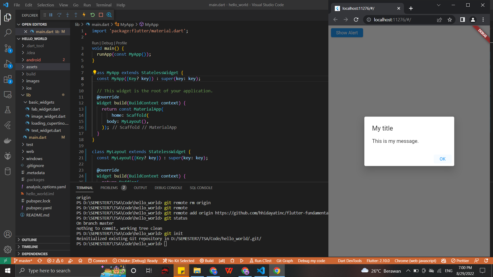
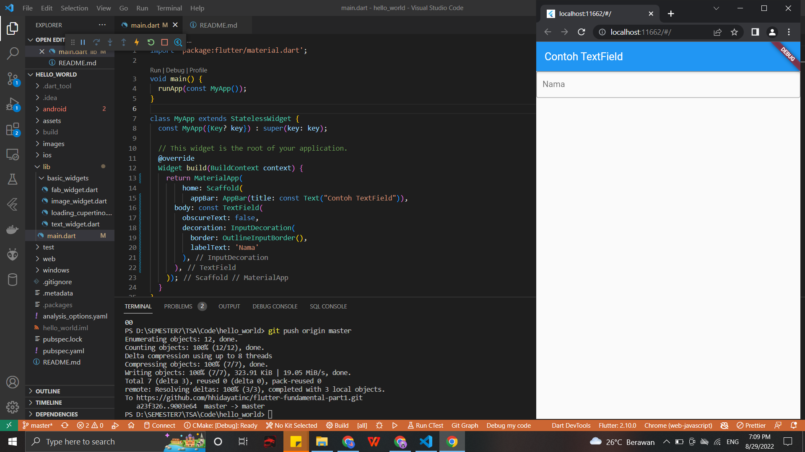
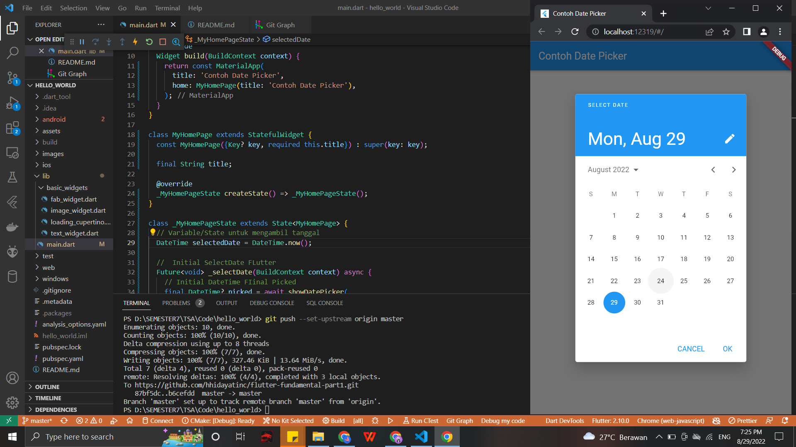
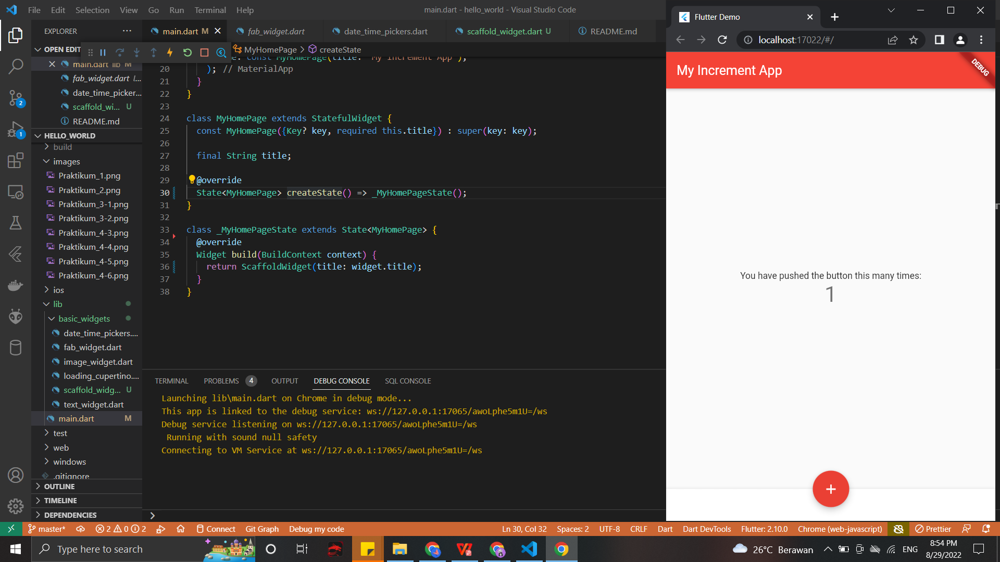
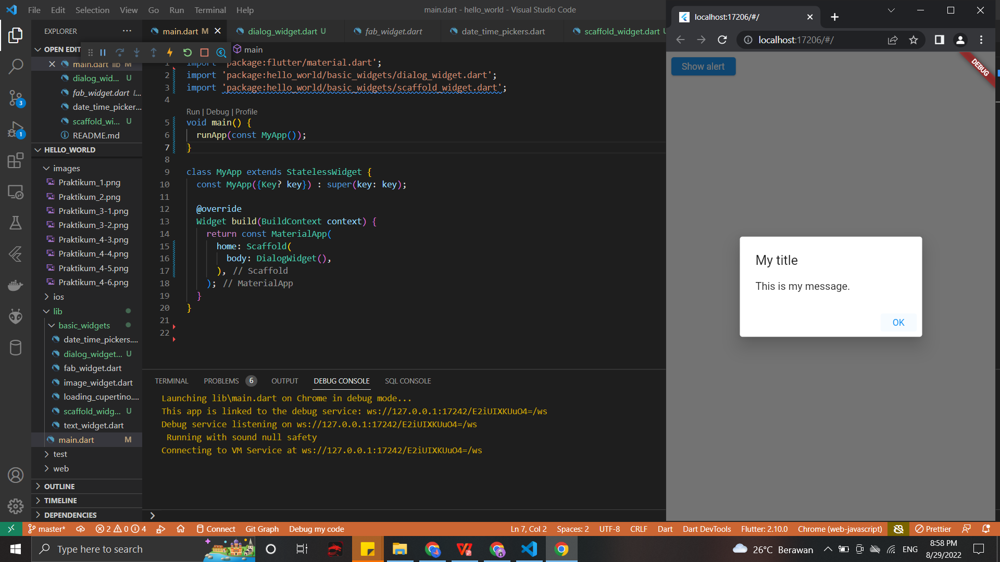
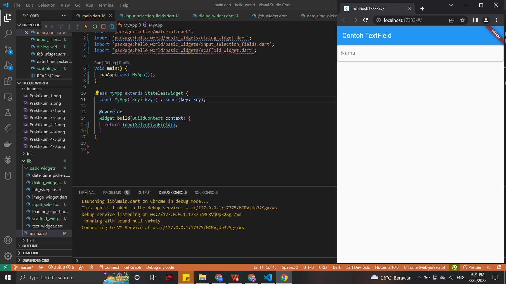
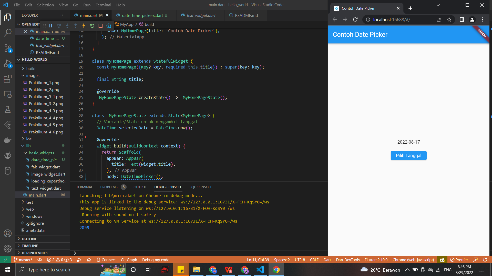

# hello_world

A new Flutter project.

Praktikum 1: Membuat Project Flutter Baru

Praktikum 2: Membuat Repository GitHub dan Laporan Praktikum

Praktikum 3: menerapkan Widget Dasar
- Langkah 1: Text Widget

- Langkah 2: Image Widget

Praktikum 4: Menerapkan Widget Material Design dan iOS Cupertino
- Langkah 3: Scaffold Widget

- Langkah 4: Dialog Widget

- Langkah 5: Input dan Selection Widget

- Langkah 6: Date and Time Pickers Widget

Tugas Praktikum

