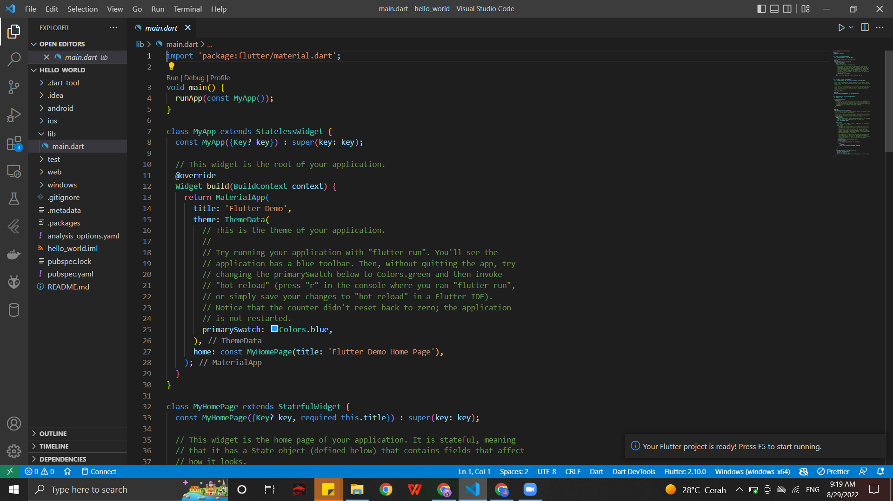

# hello_world

A new Flutter project.

Praktikum 1: Membuat Project Flutter Baru

Praktikum 2: Membuat Repository GitHub dan Laporan Praktikum

Praktikum 3: menerapkan Widget Dasar
- Langkah 1: Text Widget

- Langkah 2: Image Widget
